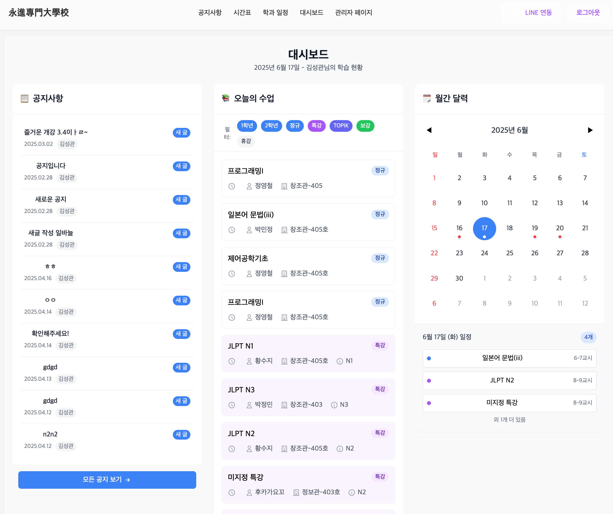
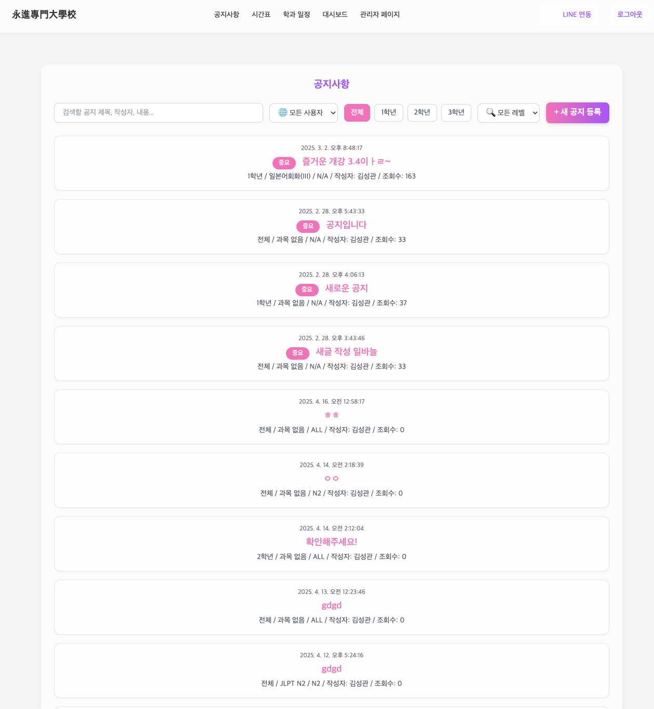
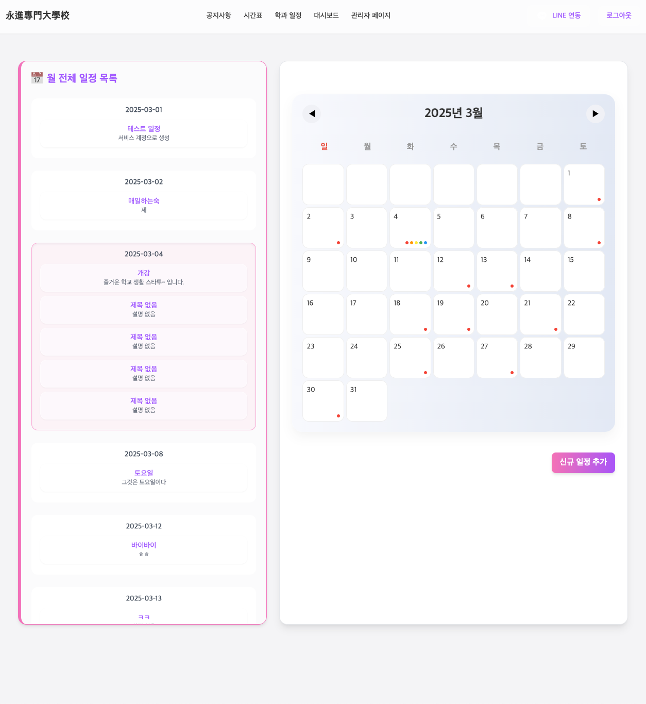
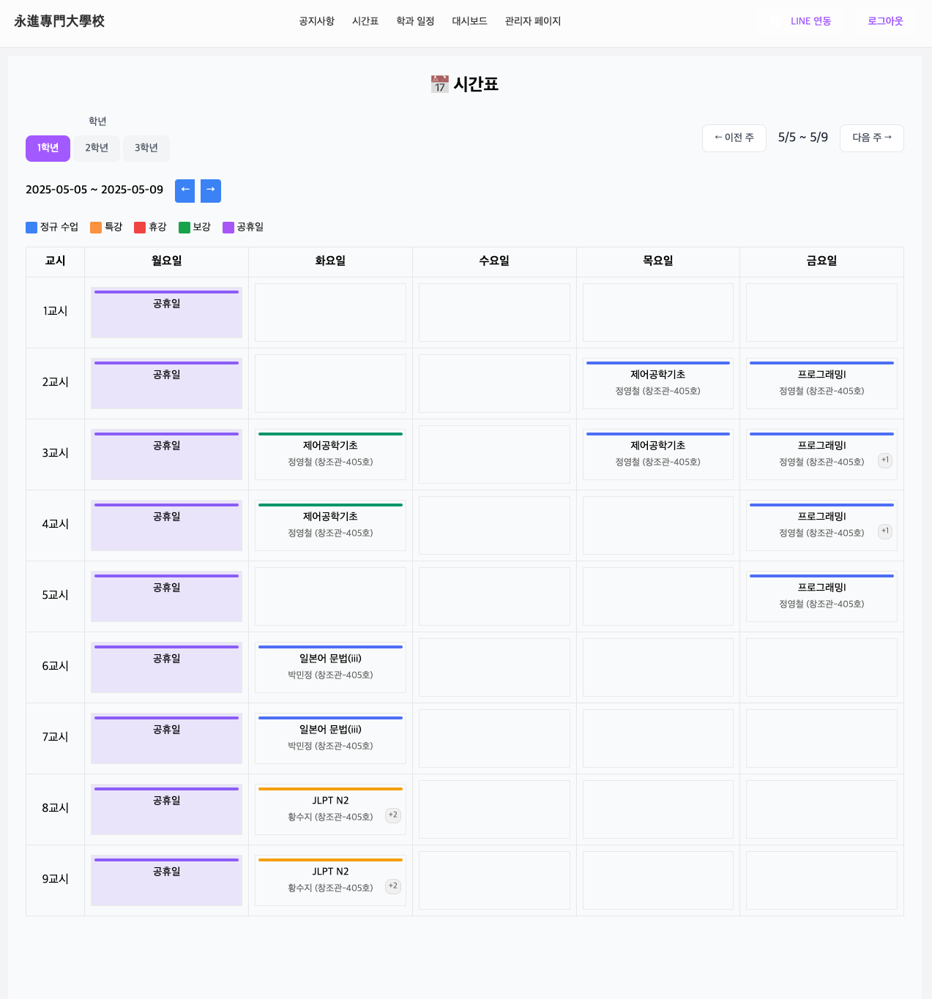
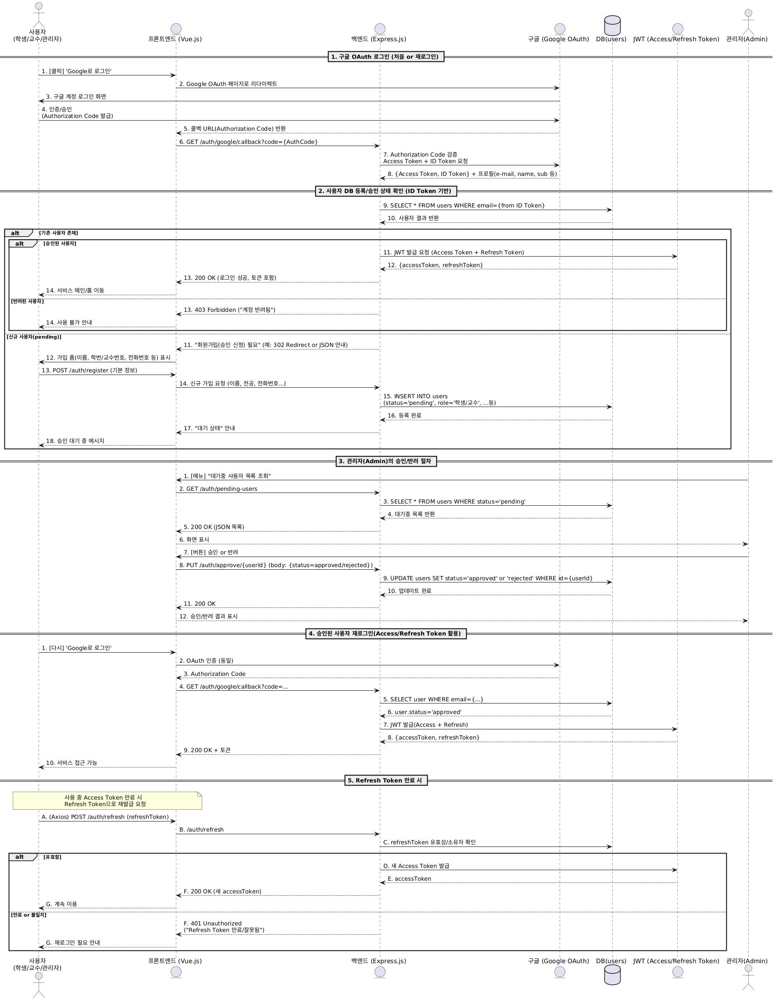

# 🎓 GSCポータル

これは、栄進専門大学グローバルシステム融合学科の学生・教職員・管理者が、
お知らせやスケジュールを簡単に確認・共有できるように設計された、
**学科専用の学務ポータルシステム**です。
---

<p align="left">
  🇰🇷 [한국어](./README.ko.md) | 🇯🇵 [日本語](./README.md)
</p>

---

## 📑 目次

- [1. プロジェクト概要](#-プロジェクト概要)
- [2. ユーザーフロー](#-ユーザーフロー)
- [3. 主な機能紹介](#-主な機能紹介)
  - [お知らせシステム](#-お知らせシステム)
  - [スケジュール管理システム](#-スケジュール管理システム)
  - [時間割システム](#-時間割システム)
  - [認証と権限](#-認証と権限)
- [4. 役割別の機能](#-役割別の機能)
- [5. 技術スタック](#-技術スタック)
- [6. 開発貢献度と期間](#-開発貢献度と期間)
- [7. ローカルでの実行方法](#-ローカルでの実行方法)
- [8. ライセンス](#-ライセンス)

---

## ✨ プロジェクト概要

* グローバルシステム融合学科の学生・教職員を対象とした**Webベースのポータルシステム**
* **お知らせ、時間割、スケジュール管理**機能を1画面に統合
* 利用者の利便性を考慮した**権限分離、リアルタイム通知、カレンダー連携、視覚的UI**を実装

---

## 👣 ユーザーフロー

1. Google OAuthログイン試行（`@g.yju.ac.kr` ドメイン）
2. 既存ユーザー → すぐにメインダッシュボードへ遷移
3. 新規ユーザー → 登録フォームを記入し、管理者の承認を待つ
4. 承認後、自動ログイン → メイン画面にアクセス

📷 例：


---

## 💡 主な機能紹介

### 📢 お知らせシステム

* 学年 / レベル / 留学生向けフィルターで絞り込み表示
* 教職員によるお知らせ作成・編集・削除
* ピン固定表示
* 添付ファイルのアップロード・ダウンロード
* LINEメッセージAPI連携 → **投稿時に自動通知**

📷 例：


---

### 🗓️ スケジュール管理システム

* 月/日ビューのカレンダーUI
* スケジュールの作成・編集・削除
* Google Calendar APIと連携し、学科イベント自動同期

📷 例：


---

### 📅 時間割システム

* 学年別の週間時間割（1〜9限）を表示
* **連続授業の統合表示**、祝日の無効化
* 授業種別によるカラー分け（正規 / 特別 / 補講 / 休講 / 祝日）
* 管理者による時間割の作成・編集・休講・補講処理

📷 例：


---

## 🔐 認証と権限

* **Google OAuthによるログイン（`@g.yju.ac.kr` 限定）**
* JWTトークンベースの自動ログインと更新処理
* 新規ユーザーは管理者承認後にアクセス可能

📊 認証フロー図：


---

## 🧑‍🤝‍🧑 役割別の機能

| 機能          |  学生 |  教員 | 管理者 |
| ----------- | :-: | :-: | :-: |
| お知らせ閲覧      |  ✅  |  ✅  |  ✅  |
| お知らせ作成・編集   |  ❌  |  ✅  |  ✅  |
| 掲示板フィルタリング  |  ✅  |  ✅  |  ✅  |
| 時間割の閲覧      |  ✅  |  ✅  |  ✅  |
| 時間割の登録・編集   |  ❌  |  ✅  |  ✅  |
| スケジュール登録・編集 |  ❌  |  ✅  |  ✅  |
| ユーザー承認管理    |  ❌  |  ❌  |  ✅  |

---

## 🛠️ 技術スタック

### 🔹 フロントエンド

* Vue 3（Composition API）
* Vite
* Tailwind CSS
* Pinia
* Vue Router

### 🔹 バックエンド

* Node.js（Express）
* JWT認証（Access + Refresh Token）

### 🔹 データベース

* MySQL

### 🔹 外部API

* Google OAuth 2.0
* Google Calendar API
* LINE Messaging API

---

## 🧑‍💻 開発貢献度と期間

> **開発者：** キム・ソングァン | **開発期間：** 2024年12月 ～ 2025年4月
> 設計から全体構成、UI/UXまで一貫して担当

* フロントエンド・バックエンド連携による**フルスタック機能の実装**
* JWT認証と管理者承認フローを設計
* Tailwindベースの**レスポンシブダッシュボードUI**
* **時間割の視覚的表示と休講・補講登録機能**を開発
* Google Calendar APIで学科スケジュール自動同期
* LINE通知APIでお知らせを**リアルタイム通知**

---

## ⚙️ ローカルでの実行方法

```bash
# 1. プロジェクトをクローン
git clone https://github.com/Theunkillabledemonking/GSC_Portal.git
cd gsc-portal

# 2. 依存関係をインストール
npm install

# 3. フロントエンドを実行
cd frontend
npm install
npm run dev

# 4. バックエンドを実行
cd backend
npm install
node server.js
```

---

## 📃 ライセンス

本プロジェクトは [MIT License](https://opensource.org/licenses/MIT) に基づいて提供されています。
自由に利用・改変・配布可能ですが、著作者表記は必須です。
